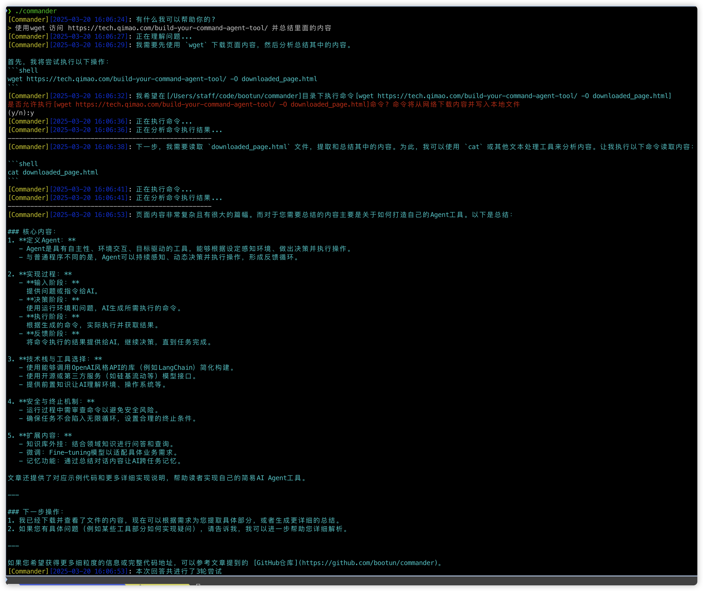
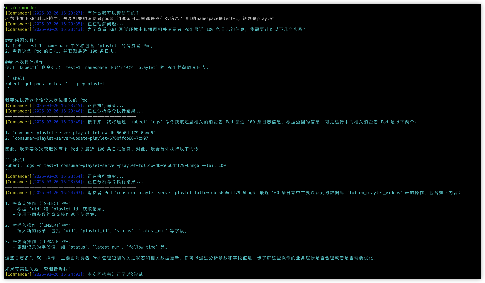

智能命令行AI助手 - Commander
===

可以帮你执行简单操作的命令行助手

## 效果

## 使用方式

### 配置
1. 创建 `config.yml` 并填写相关配置信息(可参考`config.example.yml`文件):
   - `reasoning_model`: 用于理解用户需求和决策的模型
   - `structured_model`: 用于生成结构化输出的模型
   - `security_model`: 用于安全检查的模型
   - `actor_model`: 用于最终回答的模型

每个模型配置需要包含:
- `model_id`: 模型ID
- `base_url`: API基础URL
- `token`: API令牌

### 运行
有多种方式指定配置文件:
1. 默认情况下，程序会查找当前目录下的 `config.yml`
2. 通过命令行参数指定: `./commander --config=/path/to/config.yml`
3. 通过环境变量指定: `COMMANDER_CONFIG=/path/to/config.yml ./commander`

> ⚠️警告: 代码仅作为示例用途，使用时请注意操作安全
